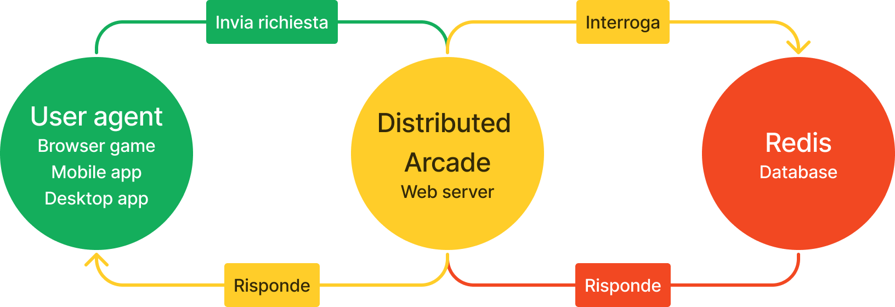
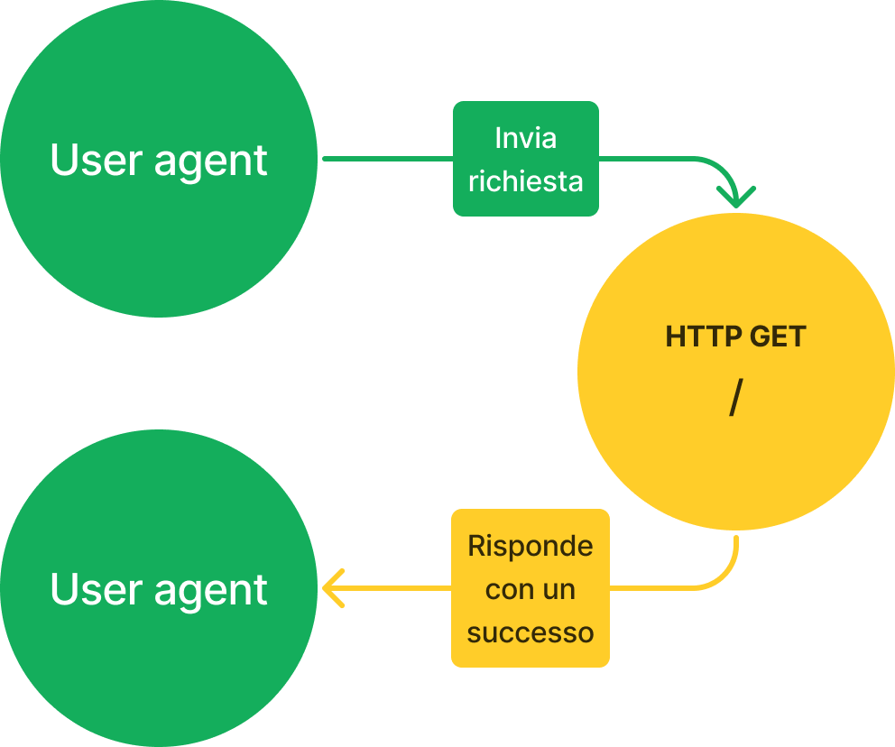
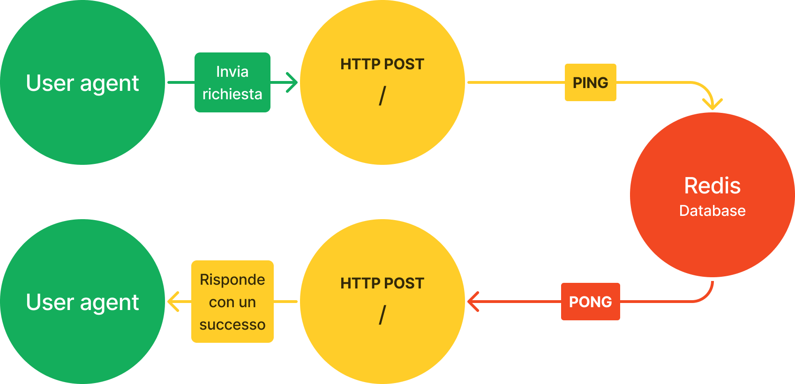
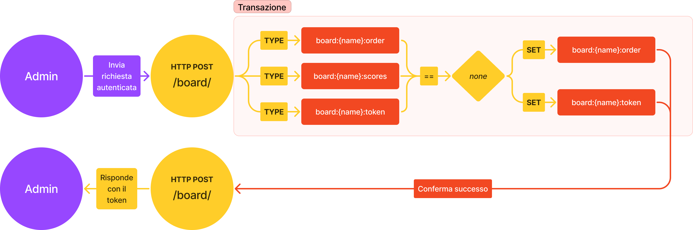
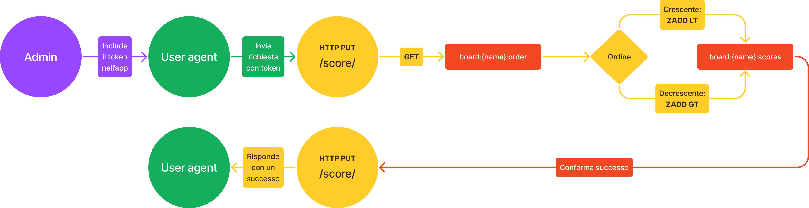
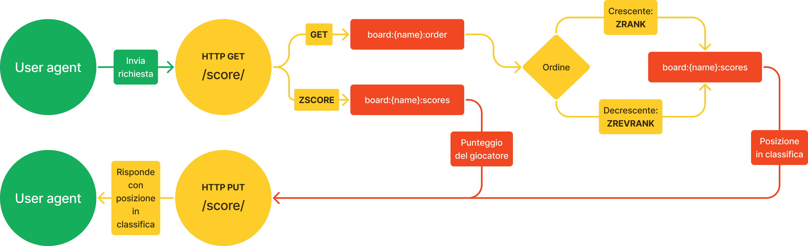
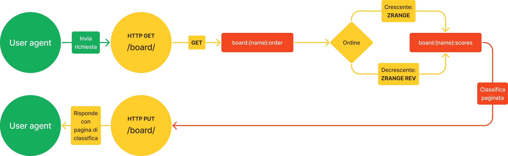
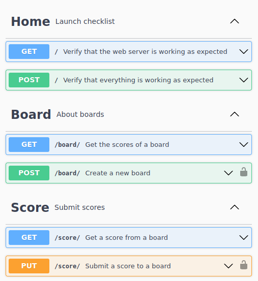

[ **Stefano Pigozzi** | Traccia #1 | Tema Big Data | Big Data Analytics | A.A. 2022/2023 | Unimore ]

# Redis per applicazioni scalabili, efficienti e veloci

> ### Approfondimento NoSQL
> 
> L’attività consiste nell’approfondire uno degli argomenti visti nelle lezioni relative ai modelli NOSQL, al CAP theorem e alle architetture per big data.
>
> Esempi di possibili approfondimenti sono:
> - **un sistema che implementa un modello NOSQL non sperimentato a lezione**
> - \[...\]
>
> Possibili fonti informative, oltre a Google e alla manualistica ufficiale, sono le digital library scientifiche come [Google Scholar](https://scholar.google.it/) e [Mendeley](https://www.mendeley.com).
>
> Al termine dell’attività di approfondimento, occorre produrre una relazione con le seguenti caratteristiche:
> - la relazione deve avere un titolo e contenere un abstract (riassunto del documento), una sezione di conclusioni e un elenco di riferimenti bibliografici;
> - è gradito includere una piccola sperimentazione pratica (es. un breve codice di prova per una piattaforma studiata, brevi frammenti di codice a confronto delle caratteristiche di diversi sistemi, ecc.), riassumendo nella parte finale della relazione cosa è stato provato e, se applicabile, i risultati ottenuti;
> - la relazione deve essere lunga almeno 2000 parole e non più di 3000 parole.

## Sinossi

In questa relazione si introduce il database key-value [Redis](https://redis.io/), ne si descrivono le funzionalità e i casi d'uso più comuni, e lo si utilizza per sviluppare [un'applicazione web scalabile e performante](https://github.com/Steffo99/distributed-arcade/), che sarà poi sottoposta a stress testing.

## Redis

**Redis** (**Re**mote **Di**ctionary **S**erver) è un database NoSQL creato e pubblicato originariamente da [Antirez](http://invece.org/), imprenditore italiano che necessitava di un database real-time e scalabile per sviluppare un [analizzatore di web log](https://github.com/antirez/lloogg), e in seguito sviluppato e mantenuto da [Redis Ltd](https://redis.com/).

È un database NoSQL con le seguenti caratteristiche:

* si basa sul paradigma **key-value**
    * i dati sono archiviati nel database associati a una determinata stringa, e possono essere richiamati attraverso di essa
    * convenzione vuole che le chiavi siano in `lower:colon:case`, come ad esempio `player:1:score`
* è interamente **in-memory**
    * tutti i dati sono salvati nella RAM per massimizzare la velocità di archiviazione e recupero
    * opzionalmente, è possibile configurare un salvataggio periodico su disco del database
* cerca di avere un **impatto minimo sulle risorse** dell'elaboratore
    * sia in termini di CPU-time, sia in termini di memoria utilizzata
    * l'overhead del database senza alcun dato dentro è di soli 3 MB
* utilizza brevi **comandi** per alterare i dati nel database
    * molto simili a comandi di una shell, facili da integrare in linguaggi di programmazione
    * tutti i comandi sono individualmente atomici, e possono essere opzionalmente combinati in transazioni atomiche
* è **loosely-typed**
    * sia chiavi sia valori sono sempre archiviati nel database come stringhe
    * sono i comandi utilizzati a determinare come i valori vengono interpretati, se come stringhe o come strutture dati
* è **facile da scalare orizzontalmente**
    * può utilizzare il paradigma master-replica, con meccanismi di sincronizzazione atomici, parziali o totali in base allo stato di connessione delle repliche
    * può essere eseguito come cluster, in cui ogni istanza gestisce un sottoinsieme delle chiavi del database complessivo

Per via delle sue caratteristiche, Redis è frequentemente utilizzato come database "secondario": per comunicazione inter-processo o inter-servizio, per caching di dati costosi da computare, o per carichi di lavoro che necessitano di numerosissimi accessi veloci a risorse.

### Tipi di dato

Redis supporta vari tipi di dati, ciascuno adatto a diversi casi d'uso.

Come menzionato in precedenza, si disambigua tra essi attraverso i comandi utilizzati per accedervi: in particolare, tutti i comandi relativi a un determinato tipo di struttura dati hanno uno specifico prefisso, come ad esempio `Z` per i sorted set.

#### Strings

Il tipo [*string*](https://redis.io/docs/data-types/strings/) in Redis in realtà si riferisce a qualsiasi tipo di dato non strutturato, inclusi numeri o byte di file binari.

I comandi che si riferiscono alle stringhe non usano alcun prefisso, e sono `O(1)`:

* `GET {key}`
    * recupera il valore alla chiave specificata
* `SET {key} {value}`
    * imposta il valore della chiave specificata
* `SET {key} {value} NX`
    * imposta il valore della chiave specificata solo se essa non esiste già
* `SET {key} {value} EX {seconds}`
    * imposta il valore della chiave specificata per il numero di secondi specificato
* `INCR {key}`
    * se il valore alla chiave è un numero, lo incrementa di 1
    * se non esiste, il numero viene prima impostato a 0
* `INCRBY {key} {number}`
    * se il valore alla chiave è un numero, lo incrementa del numero specificato
    * se non esiste, il numero viene prima impostato a 0

Sono utili per archiviare e recuperare velocemente attributi di un'entità, implementare meccanismi di sincronizzazione (lock, semafori), realizzare controlli di accesso effimeri (rate limiting), o effettuare conteggi di particolari eventi.

#### Lists

Il tipo [*list*](https://redis.io/docs/data-types/lists/) in Redis rappresenta una serie ordinata di valori stringa.

I principali comandi delle liste usano i prefissi `L` o `R`, e sono `O(1)`:

* `LPUSH {key} {value}`
    * aggiunge un valore all'inizio della lista specificata
* `RPUSH {key} {value}`
    * aggiunge un valore alla fine della lista specificata
* `LPOP {key}`
    * recupera ed elimina il valore all'inizio della lista specificata
* `RPOP {key}`
    * recupera ed elimina il valore all'inizio della lista specificata

Particolari comandi relativi alle liste permettono al client Redis di bloccare la chiamata fino a che non si verifica una determinata condizione, come ad esempio:

* `BLPOP {key}`
    * se esiste, recupera ed elimina il valore all'inizio della lista specifiata
    * se non esiste, attende che venga inserito un valore nella lista prima di restituirlo

I comandi relativi alle liste sono tipicamente utilizzati per realizzare pile (stacks) e code (queues) di eventi, prodotti da alcuni processi e consumati da altri.

#### Sets

Il tipo [*set*](https://redis.io/docs/data-types/sets/) in Redis rappresenta un insieme di valori stringa unici non ordinato.

I principali comandi dei set usano il prefisso `S`, e sono `O(1)`:

* `SADD {key} {value}`
    * aggiunge un valore all'insieme specificato
* `SISMEMBER {key} {value}`
    * verifica se un valore appartiene all'insieme specificato
* `SCARD {key}`
    * conta il numero di elementi nell'insieme specificato

Alcuni comandi permettono di effettuare operazioni tra due insiemi in tempo `O(N)`:

* `SINTER {key1} {key2}`
    * effettua l'intersezione tra due insiemi, e restituisce i valori dell'insieme risultante
* `SUNION {key1} {key2}`
    * effettua l'unione tra due insiemi, e restituisce i valori dell'insieme risultante

Sono usati nei casi in cui l'**unicità** degli elementi è un fattore chiave dell'operazione che si desidera effettuare, come ad esempio per raccogliere gli identificativi di tutti gli utenti che hanno letto un post su un forum.

#### Sorted sets

Il tipo [*sorted set*](https://redis.io/docs/data-types/sorted-sets/) in Redis rappresenta un insieme di valori stringa unici ordinato in base a un punteggio associato a ciascun valore.

I principali comandi dei sorted set usano il prefisso `Z`, e sono `O(log(N))`:

* `ZADD {key} {score} {value}`
    * aggiunge un valore all'insieme specificato con un dato punteggio
* `ZRANGE {key} {start} {stop}`
    * recupera i valori presenti nell'insieme specificato tra i dati indici (inclusi)
* `ZSCORE {key} {value}`
    * recupera il punteggio nell'insieme specificato di un dato valore
* `ZRANK {key} {value}`
    * restituisce la posizione del valore dato nell'insieme specificato

Sono usati in casi in cui si necessita di una struttura **sempre ordinata** di elementi unici, come nell'applicazione allegata a questa relazione, in cui sono stati usati per realizzare delle classifiche.

#### Altre strutture dati

Redis supporta altre strutture dati meno frequentemente usate:

* gli [*hashes*](https://redis.io/docs/data-types/hashes/), collezioni chiave-valore innestate in una singola chiave Redis, con prefisso `H`
* gli [*stream*](https://redis.io/docs/data-types/streams/), registri in cui è solo possibile aggiungere valori, con prefisso `X`
* gli indici [*geospatial*](https://redis.io/docs/data-types/geospatial/), in grado di processare coordinate cartesiane o geografiche, con prefisso `GEO`
* gli [*hyperloglog*](https://redis.io/docs/data-types/hyperloglogs/), strutture dati probabilistiche in grado di stimare velocemente la cardinalità di insiemi molto grandi, con prefisso `PF`
* le [*bitmap*](https://redis.io/docs/data-types/bitmaps/), array di bit che possono essere modificati o interrogati individualmente, con prefisso o suffisso `BIT`
* i [*bitfields*](https://redis.io/docs/data-types/bitfields/), interi signed e unsigned di dimensione variabile, attraverso il comando `BITFIELD`

## Disponibilità e scalabilità

Redis offre numerose funzionalità per fare in modo che il database rimanga sempre disponibile e possa scalare orizzontalmente per supportare numeri di accessi sempre crescenti.

### Replicazione

È possibile creare illimitate [*repliche*](https://redis.io/docs/management/replication/) in sola lettura di qualsiasi database Redis.

Le repliche si connettono al database originale, richiedono ad esso una **sincronizzazione totale**, e poi mantengono la connessione aperta per ricevere dall'originale il **flusso di comandi** necessario a mantenere i dati sincronizzati.

Nel caso una replica perdesse la connessione all'originale, essa continuerebbe a funzionare indipendentemente, e al ripristino della connessione essa può richiedere una **sincronizzazione parziale**, ricevendo i cambiamenti avvenuti al database dal momento della disconnessione.

Questo modello di replicazione offre notevoli benefici di scalabilità, rendendo possibile ad esempio:

* **distribuzione geografica** del carico di lavoro, minimizzando la latenza tra utente e servizio
* **delegarazione a repliche** di query di letture computazionalmente costose, conservando potenza computazionale dell'originale per la gestione delle scritture
* **sostituzione dell'originale con una replica** mentre il software del database viene aggiornato, mantenendolo accessibile tutto il tempo

La sincronizzazione tra le repliche è effettuata asincronamente: ciò significa che la **consistenza non è garantita**, ma che, con il passare del tempo, il database convergerà alla consistenza.

#### Sentinel

A questo sistema può essere aggiunto il servizio [*Redis Sentinel*](https://redis.io/docs/management/sentinel/), un daemon che:

* monitora il database originale e le sue repliche
* notifica l'amministratore automaticamente nel caso di downtime di un'istanza di Redis
* promuove una delle repliche a "principale" nel caso il database originale smettesse di essere accessibile
* comunica autorevolmente alle altre repliche l'indirizzo del nuovo database principale nel caso di un cambio, facendo da coordinatore per evitare che la rete di repliche si frammenti

### Clustering

È possibile configurare più istanze di Redis perchè funzionino come un unico database utilizzando [*Redis Cluster*](https://redis.io/docs/management/scaling/).

In modalità Cluster, i Redis si spartiscono l'autorità sulle chiavi inserite, effettuandone l'hash per determinare qual è il Redis con l'autorità per modificarla.

In particolare, l'hash viene effettuato sulla parte di chiave contenuta tra parentesi graffe, permettendo a una data istanza di avere l'autorità su tutte le chiavi relative a una certa entità.

Ad esempio, tutte queste chiavi saranno assegnate alla stessa istanza:

```
board:{first}:scores
board:{first}:name
board:{first}:creation_date
user:{first}:name
```

Queste chiavi potrebbero invece venire assegnate a un'altra istanza:

```
board:{second}:scores
user:{third}:name
second
```

Come per le repliche, essendo la sincronizzazione tra i cluster effettuata asincronamente, la **consistenza non è garantita**.

## Applicazione

Per testare le caratteristiche di Redis, si è sviluppato una piccola applicazione che lo utilizza.

L'applicazione, [***Distributed Arcade***](https://github.com/Steffo99/distributed-arcade), è un servizio di gestione classifiche in grado di processare l'immissione di numerosissimi punteggi senza avere grossi costi di performance sulle macchine su cui è ospitato.

L'applicazione è intesa per essere utilizzata da videogiochi disponibili su svariate piattaforme (*user agent*): browser web, desktop computer, smartphone, tablet...  
A tale scopo, si è scelto di realizzarla come una web API, attraverso la quale gli user agent possono interfacciarsi in modo controllato al database Redis.



### Linguaggio e dipendenze

Al fine di minimizzare il tempo richiesto per l'esecuzione di una richiesta, si è deciso di realizzare l'applicazione in [Rust](http://rust-lang.org/), un linguaggio di programmazione compilato, sicuro ed efficiente, e in particolare con il framework web [Axum](https://crates.io/crates/axum).

Per permettere all'applicazione di interfacciarsi con Redis, si è scelto di usare la [crate `redis`](https://crates.io/crates/redis), che gestisce i dettagli a basso livello di connessione e permette di chiamare comandi Redis all'interno del codice come se fossero coroutine.

```rust
// Un esempio di chiamata del comando Redis ZSCORE da Rust
let score: f64 = rconn.zscore("board:example:scores", "player:steffo").await
    .expect("to successfully retrieve the score");
```

### Funzionalità

Distributed Arcade permette agli user agent che vi si connettono di effettuare [6 tipi di operazioni](https://petstore.swagger.io/?url=https://raw.githubusercontent.com/Steffo99/distributed-arcade/main/docs/openapi.yaml).

#### Ping semplice

Effettuando una richiesta `HTTP GET /`, è possibile verificare che la parte web dell'applicazione sia configurata correttamente.

In caso positivo, essa risponderà all'user agent con il codice di successo `HTTP 204`.



#### Ping completo

Effettuando una richiesta `HTTP POST /`, è possibile verificare che sia l'applicazione sia Redis siano configurati correttamente.

Se l'applicazione è configurata correttamente, essa invierà il comando [`PING`](https://redis.io/commands/ping/) a Redis, e se anch'esso è configurato correttamente, risponderà con la stringa `PONG`, che sarà verificata da Distributed Arcade, rispondendo all'user agent con `HTTP 204`.



#### Creazione di board

Nell'applicazione, amministratori autorizzati possono creare ***board*** ("tabelloni", da *leaderboard*, "classifica"), ricevendo un ***token*** (una stringa di testo url-safe generata in modo crittograficamente sicuro) per l'immissione di punteggi in esso.

Per creare un board, l'amministratore deve inviare una richiesta `HTTP POST /board/` verso l'applicazione, contenente i dati del board che vuole creare:

* il ***nome*** del board
* l'***ordinamento*** del board, ovvero se devono essere considerati migliori i punteggi più bassi (***crescente***, come nel golf o nelle gare di corsa) o più alti (***decrescente***, come nel salto in alto o nel calcio)

Per ostacolare attacchi [denial-of-service](https://en.wikipedia.org/wiki/Denial-of-service_attack) al database Redis, si richiede all'amministratore di allegare alla richiesta (nell'header `Authorization`) una password, impostata all'installazione di Distributed Arcade.

Per la creazione effettiva del board, internamente vengono effettuate alcune operazioni:

1. viene aperta una transazione attraverso il comando [`MULTI`]
2. viene verificato che nessuna delle chiavi utilizzate dal board contengano già dati
3. viene salvato l'ordinamento nella chiave `board:{name}:order` con il comando [`SET`]
4. viene generata in modo crittograficamente sicuro una stringa detta ***token*** che viene archiviata nella chiave `board:{name}:token` con il comando [`SET`]
5. viene eseguita la transazione attraverso il comando [`EXEC`]

Terminata la creazione, l'user agent riceve una risposta `HTTP 201` contenente il token generato.



[`MULTI`]: https://redis.io/commands/multi/
[`SET`]: https://redis.io/commands/set/
[`EXEC`]: https://redis.io/commands/exec/

#### Invio di punteggi

Una volta creato un board, è possibile utilizzare il token restituito nel momento della sua creazione per inviare nuovi ***score*** (punteggi) al database.

Per inviare un nuovo punteggio, un user agent dovrà effettuare una richiesta `HTTP PUT /score/` verso l'applicazione, specificando:

* il nome del giocatore
* il punteggio raggiunto
* il nome del board all'interno del quale si vuole inserire il punteggio

Ricevuta una richiesta, Distributed Arcade effettua le seguenti operazioni:

1. recupera il token del board specificato attraverso il comando [`GET`] `board:{name}:token`
2. verifica che il token coincida con quello archiviato
3. recupera l'ordinamento del board con [`GET`] `board:{name}:order`
4. inserisce il punteggio nella chiave `board:{name}:scores` attraverso il comando Redis [`ZADD`], modificando il punteggio solo in caso di miglioramento:
    * se il board è in ordine crescente, specifica il parametro `LT`, in modo che punteggi più bassi sovrascrivano quelli più alti
    * se il board è in ordine decrescente, specifica il parametro `GT`, in modo che punteggi più alti sovrascrivano quelli più bassi
5. [recupera il nuovo punteggio e la nuova posizione del giocatore come descritto nel paragrafo successivo](recupero-di-punteggi)

Completate le operazioni, l'applicazione restituisce all'user agent il codice `HTTP 201` se il punteggio è stato aggiornato, oppure `HTTP 200` in caso contrario.  
In entrambi i casi, il corpo della risposta conterrà punteggio e posizione attuali del giocatore in formato JSON, come se fosse stato effettuato un [recupero di punteggi](recupero-di-punteggi).



[`GET`]: https://redis.io/commands/get/
[`ZADD`]: https://redis.io/commands/zadd/

#### Recupero di punteggi

In qualsiasi momento, un user agent può richiedere di ricevere il punteggio e la posizione in classifica di un giocatore effettuando una richiesta `HTTP GET /score/`, specificando il nome del board e del giocatore interessati.

Alla ricezione, Distributed Arcade:

1. Recupera il punteggio attuale del giocatore eseguendo il comando [`ZSCORE`] sulla chiave `board:{name}:scores`
2. Recupera l'ordinamento del board attraverso il comando [`GET`] `board:{name}:order`
3. In base all'ordinamento del board, per ottenere la posizione in classifica del giocatore:
    * se il board è in ordine crescente, utilizza il comando [`ZRANK`] `board:{name}:scores`
    * se il board è in ordine decrescente, utilizza invece il comando [`ZREVRANK`] `board:{name}:scores`

Al termine dell'elaborazione, i dati recuperati sono restituiti nel corpo della risposta in formato JSON:

```json
{
    "score": 1234.56,
    "rank": 0
}
```
> La posizione in classifica restituita è indicizzata a 0, quindi questo giocatore sarebbe primo nel suo board!



[`ZSCORE`]: https://redis.io/commands/zscore/
[`GET`]: https://redis.io/commands/get/
[`ZRANK`]: https://redis.io/commands/zrank/
[`ZREVRANK`]: https://redis.io/commands/zrevrank/

#### Recupero di classifiche

Infine, gli user agent possono richiedere i dati di un'intero board attraverso una richiesta `HTTP GET /board/`, specificando il nome del board in questione, e l'offset di inizio e dimensione di una pagina di classifica.

Questa richiesta farà in modo che Distributed Arcade:

1. recuperi l'ordinamento del board con il comando [`GET`] `board:{name}:order`
2. in base all'ordinamento, effettui uno dei due seguenti comandi per ottenere una pagina di classifica:
    * se il board è in ordine crescente, [`ZRANGE`] `board:{name}:scores` `{offset}` `{offset + size}` `WITHSCORES`
    * se il board è in ordine decrescente, [`ZRANGE`] `board:{name}:scores` `{offset}` `{offset + size}` `REV` `WITHSCORES`

La pagina ottenuta verrà poi restituita all'user agent, assieme a un codice `HTTP 200`:

```jsonc
[
  {
    "name": "Offets :)",
    "score": 2468.19
  },
  {
    "name": "Steffo :(",
    "score": 1234.56
  },
  // [...]
]
```



[`GET`]: https://redis.io/commands/get/
[`ZRANGE`]: https://redis.io/commands/zrange/

## Testing e benchmarking

Al fine di verificare correttezza ed efficacia del software, sono stati effettuati test manuali ed automatici.

### Richieste manuali

All'applicazione è stata allegato un file [`openapi.yaml`](https://github.com/Steffo99/distributed-arcade/blob/main/docs/openapi.yaml), che descrive tutti i metodi dell'API e può essere interpretato da software esterni [per essere renderizzato](https://swagger.io/tools/swagger-ui/) o perchè essi forniscano [assistenza allo sviluppo di consumatori dell'API](https://www.jetbrains.com/help/idea/openapi.html).

Per effettuare test manuali di correttezza dell'API, si è fatto particolare uso di uno di questi renderer, [**Swagger UI**](https://petstore.swagger.io/?url=https://raw.githubusercontent.com/Steffo99/distributed-arcade/main/docs/openapi.yaml).



### Richieste HTTP di esempio

All'applicazione è stato anche allegato un file [`examples.http`](https://github.com/Steffo99/distributed-arcade/blob/main/docs/examples.http) contenente alcune richieste HTTP di esempio che è possibile utilizzare per testare semi-automaticamente il software.

### Stress testing

Per verificare l'efficienza dell'applicazione e del database Redis ad essa connesso, è stato utilizzato [Siege](https://www.joedog.org/siege-home/), un tool per lo stress testing di siti web, configurandolo in modo che inviasse più richieste HTTP possibili di [invio di punteggi](invio-di-punteggi).

I risultati ottenuti sono stati eccellenti: è stato raggiunto prima un collo di bottiglia nell'invio delle richieste che nell'elaborazione di esse, superando le **2400 richieste processate/secondo** in locale su un `AMD Ryzen 5 1600X Six-Core @ 12x 3.6GHz`!

## Possibile estensione: clustering

Nel caso fosse necessaria una capacità di elaborazione ancora più elevata, modificando leggermente il nome delle chiavi utilizzate per i board per renderle compatibili, dovrebbe essere possibile realizzare un [cluster](clustering) di client Redis, permettendo un maggiore throughput in scrittura.

## Conclusione

Redis rispetta le caratteristiche con cui si presenta, ovvero di **semplicità**, **efficienza**, **velocità** e **scalabilità**, confermandosi una buona scelta sia nella sua tipica funzione di database secondario, sia nella meno convenzionale funzione di database secondario.

L'applicazione sviluppata ha soddisfatto tutti i requisiti che ci si era posti all'inizio dello sviluppo, ed è stata messa in produzione con successo: è raggiungibile all'indirizzo *[https://arcade.steffo.eu/](https://arcade.steffo.eu/)*, e si spera di utilizzarla in applicazioni future.

## Bibliografia

La bibliografia è deliberatamente omessa in quanto tutte le fonti utilizzate sono referenziate direttamente all'interno del documento come collegamenti ipertestuali.

Nel caso si stia leggendo una copia della relazione stampata senza rendering dei collegamenti, si riportano qui sotto le principali fonti:

* **Documentazione** di Redis - https://redis.io/docs/
* **Redis** su Wikipedia - https://en.wikipedia.org/w/index.php?title=Redis&oldid=1115152231
* **Repository** di Distributed Arcade - https://github.com/Steffo99/distributed-arcade
* **Documentazione** di Siege - https://www.joedog.org/siege-home/